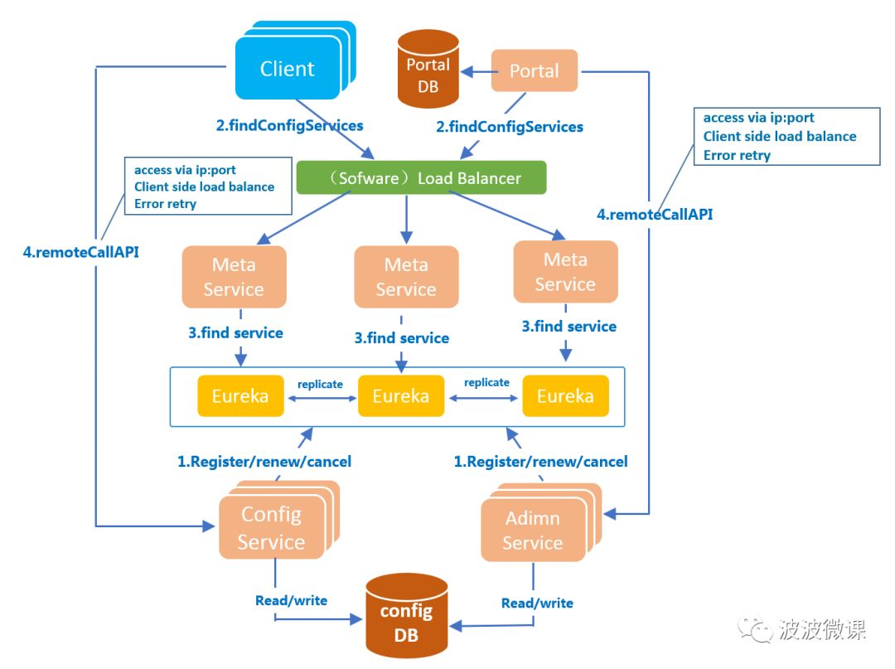

# 第10章 apollo

## 简介

携程出的配置中心

## 核心功能点

1. 统一管理不同环境(environment)，不同集群(cluser),不同命名空间(namespace)的配置
   1. 同一份代码部署在不同的集群，可以有不同的配置
   2. 通过命名空间支持多个不同应用共享一份配置
2. 热发布
3. 版本管理，配置是有版本的概念
4. 灰度发布，只对部分实例生效
5. 权限管理，发布审核，操作审计
6. 客户端配置信息监控
7. java 和.net客户端
8. 提供开放平台API，只需要符合基本格式就能报错，实际上配置文件可能有xml,json,dal
9. 部署简单，仅需要mysql

## 核心概念

1. 应用：根据APPid指定
2. 环境
3. 集群
4. 命名空间，对配置分类
5. 权限控制

## 本地部署

docker

## 后台使用

## java中使用

```xml
<dependency>
    <groupId>com.ctrip.framework.apollo</groupId>
    <artifactId>apollo-client</artifactId>
    <version>1.8.0</version>
</dependency>
```

```java
final Config appConfig = ConfigService.getAppConfig();
```


### Meta server

Apollo 支持在不同环境有不同配置，所以需要运行 提供给apollo客户端当前环境的 meta server信息。默认情况下。meta server 和 config service 在一个jvm 进程里，所以meta server的地址就是config service的地址

### appid 配置

应用的身份信息

app.properties

### environment 配置

本身跟项目无关，两种配置方式

1. 通过java的system
   1. system.setProperty("env","dev")
   2. java启动脚本里指定 -Denv=dev
2. 通过配置文件
   1. 对于mac/linux 文件位置在 /opt/settings/server.properties
   2. 对于win，c:\opt\settings\server.properties

### 监听配置变换事件

config类可以添加监听器

### springboot中使用

引入依赖

```xml
<dependency>
    <groupId>com.ctrip.framework.apollo</groupId>
    <artifactId>apollo-client</artifactId>
    <version>1.8.0</version>
</dependency>
```

```yaml
app:
  id: demo
apollo:
  meta: http://localhost:8080
  bootstrap:
    enabled: true
    namespace: application
```

### placeholder  注入配置

### java config 

### configuationpeoperties

### spring的支持

## apollo架构



下面是Apollo的七个模块，其中四个模块是和功能相关的核心模块，另外三个模块是辅助服务发现的模块：

#### 四个核心模块及其主要功能

1. **ConfigService**

2. - 提供配置获取接口
   - 提供配置推送接口
   - 服务于Apollo客户端

3. **AdminService**

4. - 提供配置管理接口
   - 提供配置修改发布接口
   - 服务于管理界面Portal

5. **Client**

6. - 为应用获取配置，支持实时更新
   - 通过MetaServer获取ConfigService的服务列表
   - 使用客户端软负载SLB方式调用ConfigService

7. **Portal**

8. - 配置管理界面
   - 通过MetaServer获取AdminService的服务列表
   - 使用客户端软负载SLB方式调用AdminService

#### 三个辅助服务发现模块

1. **Eureka**

2. - 用于服务发现和注册
   - Config/AdminService注册实例并定期报心跳
   - 和ConfigService住在一起部署

3. **MetaServer**

4. - Portal通过域名访问MetaServer获取AdminService的地址列表
   - Client通过域名访问MetaServer获取ConfigService的地址列表
   - 相当于一个Eureka Proxy
   - 逻辑角色，和ConfigService住在一起部署

5. **NginxLB**

6. - 和域名系统配合，协助Portal访问MetaServer获取AdminService地址列表
   - 和域名系统配合，协助Client访问MetaServer获取ConfigService地址列表
   - 和域名系统配合，协助用户访问Portal进行配置管理

7. https://mp.weixin.qq.com/s/-hUaQPzfsl9Lm3IqQW3VDQ 详细介绍

### apollo服务端设计

配置中心最重要的就是实时推送配置，apollo流程如下

+ 用户在portal进行配置的编辑和发布
+ portal调用admin service提供的接口进行发布
+ admin service接到请求后发送releasemessage 给各个config service
+ config service接到请求后，通知对应的客户端

### [2.1.1 发送ReleaseMessage的实现方式](https://www.apolloconfig.com/#/zh/design/apollo-design?id=_211-发送releasemessage的实现方式)

从概念上来看，这是一个典型的消息使用场景，Admin Service作为producer发出消息，各个Config Service作为consumer消费消息。通过一个消息组件（Message Queue）就能很好的实现Admin Service和Config Service的解耦。

在实现上，考虑到Apollo的实际使用场景，以及为了尽可能减少外部依赖，我们没有采用外部的消息中间件，而是通过数据库实现了一个简单的消息队列。

实现方式如下：

1. Admin Service在配置发布后会往ReleaseMessage表插入一条消息记录，消息内容就是配置发布的AppId+Cluster+Namespace，参见[DatabaseMessageSender](https://github.com/ctripcorp/apollo/blob/master/apollo-biz/src/main/java/com/ctrip/framework/apollo/biz/message/DatabaseMessageSender.java)
2. Config Service有一个线程会每秒扫描一次ReleaseMessage表，看看是否有新的消息记录，参见[ReleaseMessageScanner](https://github.com/ctripcorp/apollo/blob/master/apollo-biz/src/main/java/com/ctrip/framework/apollo/biz/message/ReleaseMessageScanner.java)
3. Config Service如果发现有新的消息记录，那么就会通知到所有的消息监听器（[ReleaseMessageListener](https://github.com/ctripcorp/apollo/blob/master/apollo-biz/src/main/java/com/ctrip/framework/apollo/biz/message/ReleaseMessageListener.java)），如[NotificationControllerV2](https://github.com/ctripcorp/apollo/blob/master/apollo-configservice/src/main/java/com/ctrip/framework/apollo/configservice/controller/NotificationControllerV2.java)，消息监听器的注册过程参见[ConfigServiceAutoConfiguration](https://github.com/ctripcorp/apollo/blob/master/apollo-configservice/src/main/java/com/ctrip/framework/apollo/configservice/ConfigServiceAutoConfiguration.java)
4. NotificationControllerV2得到配置发布的AppId+Cluster+Namespace后，会通知对应的客户端

### [2.1.2 Config Service通知客户端的实现方式](https://www.apolloconfig.com/#/zh/design/apollo-design?id=_212-config-service通知客户端的实现方式)

实现方式如下：

1. 客户端会发起一个Http请求到Config Service的`notifications/v2`接口，也就是[NotificationControllerV2](https://github.com/ctripcorp/apollo/blob/master/apollo-configservice/src/main/java/com/ctrip/framework/apollo/configservice/controller/NotificationControllerV2.java)，参见[RemoteConfigLongPollService](https://github.com/ctripcorp/apollo/blob/master/apollo-client/src/main/java/com/ctrip/framework/apollo/internals/RemoteConfigLongPollService.java)
2. NotificationControllerV2不会立即返回结果，而是通过[Spring DeferredResult](http://docs.spring.io/spring/docs/current/javadoc-api/org/springframework/web/context/request/async/DeferredResult.html)把请求挂起
3. 如果在60秒内没有该客户端关心的配置发布，那么会返回Http状态码304给客户端
4. 如果有该客户端关心的配置发布，NotificationControllerV2会调用DeferredResult的[setResult](http://docs.spring.io/spring/docs/current/javadoc-api/org/springframework/web/context/request/async/DeferredResult.html#setResult-T-)方法，传入有配置变化的namespace信息，同时该请求会立即返回。客户端从返回的结果中获取到配置变化的namespace后，会立即请求Config Service获取该namespace的最新配置。

```java
@RestController
public class NotificationControllerV2 implements ReleaseMessageListener {
    // 模拟配置更新，向数据库插入新数据
    public static Queue<String> queue = new LinkedBlockingDeque<>();

    @RequestMapping(method = {
            RequestMethod.GET}, path = {"/addmsg"})
    public String addMsg() {
        queue.add("xxx");
        return "success";
    }
    }
```


模拟config service扫描表

```java
@Component
public class ReleaseMessageScanner implements InitializingBean {
    @Autowired
    private NotificationControllerV2 notificationControllerV2;
    @Override
    public void afterPropertiesSet() throws Exception {
        new Thread(()->{
            for (;;){
                final String poll = NotificationControllerV2.queue.poll();
                if (poll != null) {
                    final ReleaseMessage releaseMessage = new ReleaseMessage(poll);
                    notificationControllerV2.handleMessage(releaseMessage);
                }
            }
        }).start();
    }
}
```


处理消息的监听器接口，以及实现逻辑；DeferredResultWrapper是基于Spring的deferredresult，类似callable


```java
public interface ReleaseMessageListener {
    void handleMessage(ReleaseMessage message);
}

@Getter
public class ReleaseMessage {

    private String message;

    public ReleaseMessage(String message) {
        this.message = message;
    }
}


@Override
public void handleMessage(ReleaseMessage message) {
    final ArrayList<DeferredResultWrapper> deferredResultWrappers = Lists.newArrayList(multimap.get("xxxx"));
    for (DeferredResultWrapper wrapper : deferredResultWrappers) {
        final List<ApolloConfigNotification> list = new ArrayList<>();
        list.add(new ApolloConfigNotification("application", 1));
        wrapper.setResult(list);
    }
}
```

```java
public class DeferredResultWrapper {
    private static final long time_out = 60 * 1000;
    private static final ResponseEntity<List<ApolloConfigNotification>> not_modify_response_list = new ResponseEntity<>(HttpStatus.NOT_MODIFIED);
    private DeferredResult<ResponseEntity<List<ApolloConfigNotification>>> result;

    public DeferredResultWrapper() {
        this.result = new DeferredResult<>(time_out, not_modify_response_list);
    }

    public void onTimeout(Runnable runnable) {
        result.onTimeout(runnable);
    }

    public void onCompletion(Runnable runnable) {
        result.onCompletion(runnable);
    }

    public void setResult(List<ApolloConfigNotification> apolloConfigNotifications) {
        result.setResult(new ResponseEntity<>(apolloConfigNotifications, HttpStatus.OK));
    }

    public DeferredResult<ResponseEntity<List<ApolloConfigNotification>>> getResult() {
        return result;
    }
}
```


客户端接入逻辑，客户端启动时调用该接口，会挂起该接口，有则更新，否则取默认

```java
@RequestMapping(method = {RequestMethod.GET}, path = {"getConfig"})
public DeferredResult<ResponseEntity<List<ApolloConfigNotification>>> getConfig() {
    final DeferredResultWrapper deferredResultWrapper = new DeferredResultWrapper();
    final List<ApolloConfigNotification> notifications = getApolloConfigNotifications();
    if (!notifications.isEmpty()) {
        deferredResultWrapper.setResult(notifications);
    } else {
        deferredResultWrapper.onTimeout(() -> {
            System.out.println("time out");
        });
        deferredResultWrapper.onCompletion(() -> {
            System.out.println("completion");
        });
        multimap.put("xxxx", deferredResultWrapper);
    }
    return deferredResultWrapper.getResult();
}
```

### apollo客户端设计

+ 客户端和服务端保持了一个长连接，从而能第一时间获得配置更新的推送。（通过Http Long Polling实现）

+ 客户端还会定时从Apollo配置中心服务端拉取应用的最新配置。
  + 这是一个fallback机制，为了防止推送机制失效导致配置不更新
  + 客户端定时拉取会上报本地版本，所以一般情况下，对于定时拉取的操作，服务端都会返回304 - Not Modified
  + 定时频率默认为每5分钟拉取一次，客户端也可以通过在运行时指定System Property: `apollo.refreshInterval`来覆盖，单位为分钟。

+ 客户端从Apollo配置中心服务端获取到应用的最新配置后，会保存在内存中
+ 客户端会把从服务端获取到的配置在本地文件系统缓存一份
  + 在遇到服务不可用，或网络不通的时候，依然能从本地恢复配置

+ 应用程序可以从Apollo客户端获取最新的配置、订阅配置更新通知

#### 和spring集成

Apollo除了支持API方式获取配置，也支持和Spring/Spring Boot集成，集成原理简述如下。

Spring从3.1版本开始增加了`ConfigurableEnvironment`和`PropertySource`：

- ConfigurableEnvironment
  - Spring的ApplicationContext会包含一个Environment（实现ConfigurableEnvironment接口）
  - ConfigurableEnvironment自身包含了很多个PropertySource
- PropertySource
  - 属性源
  - 可以理解为很多个Key - Value的属性配置

在运行时的结构形如： 

需要注意的是，PropertySource之间是有优先级顺序的，如果有一个Key在多个property source中都存在，那么在前面的property source优先。

所以对上图的例子：

- env.getProperty(“key1”) -> value1
- **env.getProperty(“key2”) -> value2**
- env.getProperty(“key3”) -> value4

在理解了上述原理后，Apollo和Spring/Spring Boot集成的手段就呼之欲出了：在应用启动阶段，Apollo从远端获取配置，然后组装成PropertySource并插入到第一个即可

#### 启动时初始化到spring

这个processor，用于初始化配置到Spring的property source

```java
@Component
public class PropertySourcesProcessor implements BeanFactoryPostProcessor, EnvironmentAware {
    String APOLLO_PROPERTY_SOURCE_NAME = "APOLLO_PROPERTY_SOURCE_NAME";
    private ConfigurableEnvironment environment;

    @Override
    public void postProcessBeanFactory(ConfigurableListableBeanFactory configurableListableBeanFactory) throws BeansException {
        final ConfigPropertySource application = new ConfigPropertySource("application", new Config());
        final CompositePropertySource compositePropertySource = new CompositePropertySource(APOLLO_PROPERTY_SOURCE_NAME);
        compositePropertySource.addPropertySource(application);
        this.environment.getPropertySources().addFirst(compositePropertySource);
    }

    @Override
    public void setEnvironment(Environment environment) {
        this.environment = (ConfigurableEnvironment) environment;
    }

}
```

```java
public class Config implements com.ctrip.framework.apollo.Config {
    @Override
    public String getProperty(String s, String s1) {
        if (s.equals("cxytiandi")) {
            return "demo";
        }
        return null;
    }


    @Override
    public boolean removeChangeListener(ConfigChangeListener configChangeListener) {
        return false;
    }

    @Override
    public Set<String> getPropertyNames() {
        Set<String> names = new HashSet<>(1);
        names.add("cxytiandi");
        return names;

    }

    
}
```

config目前就假设实现了2个函数，配置拉取后会保存在该类里

显而易见，只有吧config包装成propertysource，才能插入到Spring的environment

```java
public class ConfigPropertySource extends EnumerablePropertySource<Config> {
    private static final String[] empty_array = new String[0];

    public ConfigPropertySource(String name, Config source) {
        super(name, source);
    }

    @Override
    public String[] getPropertyNames() {
        final Set<String> propertyNames = this.source.getPropertyNames();
        if (propertyNames.isEmpty()) {
            return empty_array;
        }
        return propertyNames.toArray(new String[propertyNames.size()]);
    }

    @Override
    public Object getProperty(String s) {
        return this.source.getProperty(name, null);
    }
}
```

#### 运行中如何刷新配置

apollo定义了springvalueprocessor类，处理spring里的值修改

```java
@Override
protected void processField(Object bean, String beanName, Field field) {
  // register @Value on field
  Value value = field.getAnnotation(Value.class);
  if (value == null) {
    return;
  }
  Set<String> keys = placeholderHelper.extractPlaceholderKeys(value.value());

  if (keys.isEmpty()) {
    return;
  }

  for (String key : keys) {
    SpringValue springValue = new SpringValue(key, value.value(), bean, beanName, field, false);
    springValueRegistry.register(beanFactory, key, springValue);
    logger.debug("Monitoring {}", springValue);
  }
}
```

把值存储到了springvalueregistry里

```java
public class SpringValueRegistry {

  private final Map<BeanFactory, Multimap<String, SpringValue>> registry = Maps.newConcurrentMap();
  private final Object LOCK = new Object();

  public void register(BeanFactory beanFactory, String key, SpringValue springValue) {
    if (!registry.containsKey(beanFactory)) {
      synchronized (LOCK) {
        if (!registry.containsKey(beanFactory)) {
          registry.put(beanFactory, LinkedListMultimap.<String, SpringValue>create());
        }
      }
    }

    registry.get(beanFactory).put(key, springValue);
  }

  public Collection<SpringValue> get(BeanFactory beanFactory, String key) {
    Multimap<String, SpringValue> beanFactorySpringValues = registry.get(beanFactory);
    if (beanFactorySpringValues == null) {
      return null;
    }
    return beanFactorySpringValues.get(key);
  }
}
```

|                        |                                      |                                                              |                                                              |
| ---------------------- | ------------------------------------ | ------------------------------------------------------------ | ------------------------------------------------------------ |
| 场景                   | 影响                                 | 降级                                                         | 原因                                                         |
| 某台Config Service下线 | 无影响                               |                                                              | Config Service无状态，客户端重连其它Config Service           |
| 所有Config Service下线 | 客户端无法读取最新配置，Portal无影响 | 客户端重启时，可以读取本地缓存配置文件。如果是新扩容的机器，可以从其它机器上获取已缓存的配置文件，具体信息可以参考[Java客户端使用指南 - 1.2.3 本地缓存路径](https://www.apolloconfig.com/#/zh/usage/java-sdk-user-guide?id=_123-本地缓存路径) |                                                              |
| 某台Admin Service下线  | 无影响                               |                                                              | Admin Service无状态，Portal重连其它Admin Service             |
| 所有Admin Service下线  | 客户端无影响，Portal无法更新配置     |                                                              |                                                              |
| 某台Portal下线         | 无影响                               |                                                              | Portal域名通过SLB绑定多台服务器，重试后指向可用的服务器      |
| 全部Portal下线         | 客户端无影响，Portal无法更新配置     |                                                              |                                                              |
| 某个数据中心下线       | 无影响                               |                                                              | 多数据中心部署，数据完全同步，Meta Server/Portal域名通过SLB自动切换到其它存活的数据中心 |
| 数据库宕机             | 客户端无影响，Portal无法更新配置     | Config Service开启[配置缓存](https://www.apolloconfig.com/#/zh/deployment/distributed-deployment-guide?id=_323-config-servicecacheenabled-是否开启配置缓存)后，对配置的读取不受数据库宕机影响 |                                                              |

基本来说。。高可用得一米