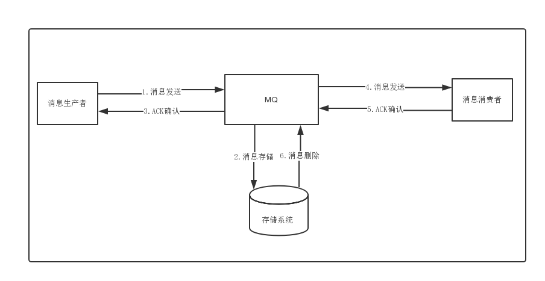

# 第十八章 分布式事务解决方案

## 两阶段型

二阶段提交型

三阶段提交（引入协调者）

## TCC补偿型

+ try 预留业务资源
+ confirm 确认执行业务操作
+ cancel 取消执行业务操作

开发成本较高

## 最终一致性

举例子：一般生产者直接调用消费者有以下几种情况：

1. 生产者操作成功，消费者也成功，皆大欢喜
2. 生产者操作成功，消费者失败，数据不一致
3. 生产者操作失败，异常处理也调用了消费者操作成功，数据不一致。

若直接加个mq进行解耦



1. 生产者没收到ack，但是mq发送数据给消费者了，数据不一致
2. 生产者发送成功，消费失败没有ack，（重复消费）数据不一致

**远程调用，结果最终可能为成功、失败、超时；而对于超时的情况，处理方最终的结果可能是成功，也可能是失败，调用方是无法知晓的。** 

解决方案就是再引入一个消息服务（充当协调者。。比对结果）和一个消息发送系统

```kotlin
@Service
class MessageService {
    /**
     * 发送消息
     */
    @PostMapping("send")
    fun sendMessage(@RequestBody message: TransactionMessage): Boolean {
        if (check(message)) {
            save(message)
            return true
        }
        return false
    }

    /**
     * 确认消息被消费
     */
    @RequestMapping(method = [RequestMethod.POST], path = ["/confirm/consume"])
    fun confirmReceived(@RequestParam id: Int, @RequestParam receiver: String): Boolean {
        val message = queryById(id)
        return message?.confirm(receiver).let { true }
        return false
    }

    /**
     * 查询最早没有被消费的消息
     */
    @RequestMapping(method=[RequestMethod.GET],path=["/waiting"])
    fun findByWaiting(@RequestParam limit:Int): List<TransactionMessage>{
        return emptyList()
    }

    /**
     * 确认死亡消息
     */
    @RequestMapping(method=[RequestMethod.POST],path=["/confirm/dead"])
    fun confirmDead(@RequestParam id: Int): String{
        return ""
    }

    /**
     * 重发
     */
    @RequestMapping(method=[RequestMethod.GET],path=["/retey/send"])
    fun retry(): String{
        return ""
    }
  
  /**
     * 增加发送次数
     */
    @RequestMapping(method=[RequestMethod.GET],path=["/retey/send"])
    fun incrSendCount(id: Int) {
        TODO("Not yet implemented")
    }
    
}

@SpringBootApplication
class TransactionMqServiceApplication{
    val log:Logger = LoggerFactory.getLogger(TransactionMqServiceApplication::class.java)
    

}

fun main(args: Array<String>) {
    val context = runApplication<TransactionMqServiceApplication>(*args)
    val task = context.getBean(ProcessMessageTask::class.java)
    task.start()
    CountDownLatch(1).await()
}

@Service
class ProcessMessageTask(val messageService: MessageService, val redission: RedissonClient,val producer: Producer) {
    val log: Logger = LoggerFactory.getLogger(ProcessMessageTask::class.java)

    private val fixedPool: ExecutorService = Executors.newFixedThreadPool(10)
    private val semaphore: Semaphore = Semaphore(20)
    fun start() {
        Thread {
            while (true) {
                val lock = redission.getLock("message-task")
                try {
                    lock.lock()
                    var sleepTime = process()
                    if (sleepTime > 0) {
                        TimeUnit.MILLISECONDS.sleep(sleepTime.toLong())
                    }
                }finally {
                    lock.unlock()
                }

            }
        }.start()
}

    private fun process(): Int {
        var sleepTime = 10000;
        val waiting = messageService.findByWaiting(5000)
        if (waiting.size == 5000){
            sleepTime = 0
        }
        val latch = CountDownLatch(waiting.size)
        for (message in waiting) {
            semaphore.acquire()
            fixedPool.execute{
                try {
                    doProcess(message)
                }finally {
                    semaphore.release()
                    latch.countDown()
                }
            }
        }
        latch.await()
        return sleepTime
    }

    private fun doProcess(message: TransactionMessage) {
        // 检查消息是否满足死亡条件
        if (message.sendCount >message.deadCount){
            messageService.confirmDead(message.id!!)
            return
        }
        // 时间间隔是否满足
        if (message.sentDateTime?.plusMinutes(1).isBefore(LocalDateTime.now())){
            log.info("发送具体消息")
            // 生产者发送消息进mq producer.send()
            messageService.incrSendCount(message.id!!)
        }
    }
}
```

调用方发送消息给 消息服务，存表（管理消息），消息推送服务，推送消息进mq

消费者消费消息（要实现幂等），找消息服务确认消费

## 最大努力型

适用于更外部交互的通讯，首先是定期通知，其次还要提供查询接口

